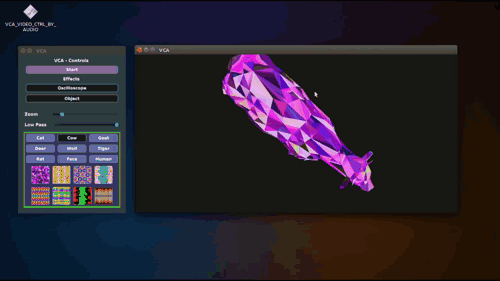

# VCA : Video Cotroled by Audio

This project was realized in order to videoproject animated 3D objects according to the differences of sound volume (in a certain frequency band), as in the gif below.
It can be use in musical performance (tested in rave party)

]

## Getting Started

To get it work you need to install the [JUCE IDE](https://juce.com/).

## LICENCE

- MIT
